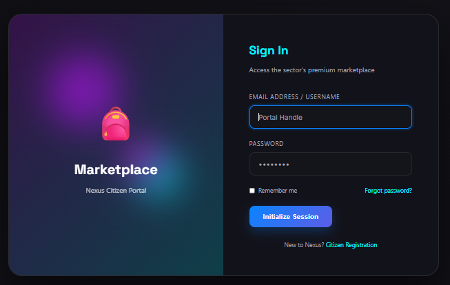
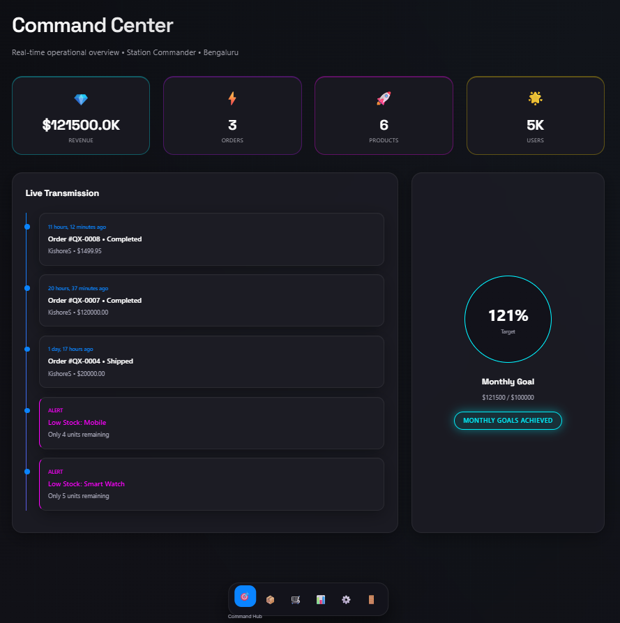
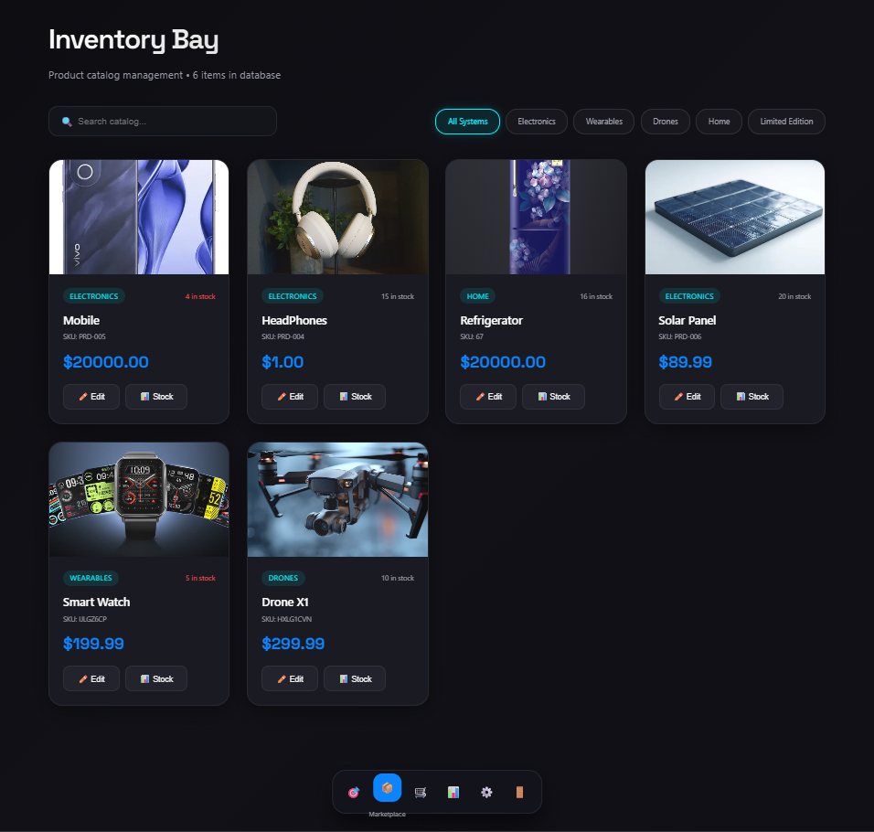
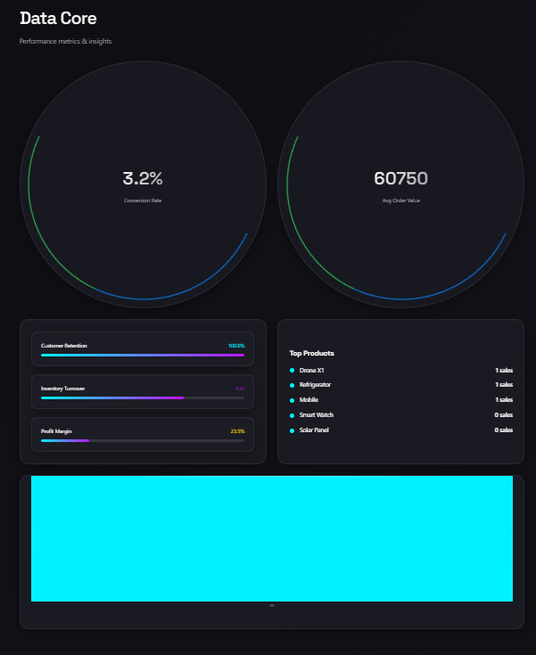
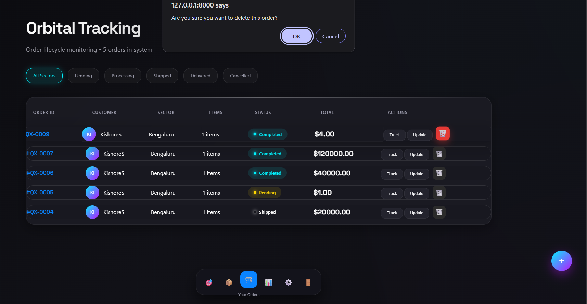

# 🛒 Shop Management System with User Authentication

A Django-based Shop Management System developed during my AI-Powered Full Stack Development Internship at Mevi Technologies LLP.

---

## 📌 Overview

This project is designed to simplify shop operations by providing a secure authentication system and modules for inventory, product, order, and analytics management.

---

## ✨ Features

- 🔐 User Authentication
- 👤 Admin & User Login
- 📦 Product Management
- 📊 Inventory Management
- 🛒 Order Management
- 📈 Analytics Dashboard
- 🎨 Modern Responsive UI

---

## 🛠️ Tech Stack

- Python
- Django
- HTML5
- CSS3
- JavaScript
- SQLite
- Git & GitHub

---

## 📂 Project Structure

```
accounts/
analytics/
inventory/
orders/
shop/
static/
templates/
```

---

## 📸 Project Screenshots

### Login Page



### Command Center



### Inventory



### Data Center



### Orbital Tracking



---

## 🚀 Installation

```bash
git clone https://github.com/KishorAchar/shop-management-system.git

cd shop-management-system

pip install -r requirements.txt

python manage.py migrate

python manage.py runserver
```

Open:

```
http://127.0.0.1:8000/
```

---

## 👨‍💻 Author

**Kishore S**

- BCA Student
- AI-Powered Full Stack Development Intern
- Aspiring Software Engineer | DevOps Enthusiast

GitHub:
https://github.com/KishorAchar

LinkedIn:
https://www.linkedin.com/in/kishores-achar
